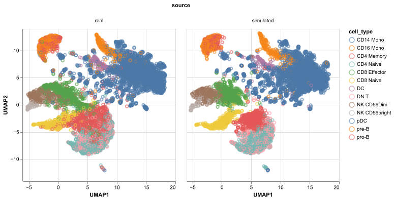

# scdiagnostics

This package has helpers for plotting real vs. simulated data generated using
the scdesigner package. You can install the latest release using

```
pip install scdiagnostics
```

For example, if `real` and `sim` are two anndata objects, you can run,

```
from scdiagnostics import compare_umap
compare_umap(real, sim)
```

and get a figure like



Refer to [this vignette](https://github.com/krisrs1128/scDesigner/blob/dc840453f14e017f8fac05cffc4f1b726a80bbb8/examples/vignettes-atac.ipynb)
for details of the underlying simulator.